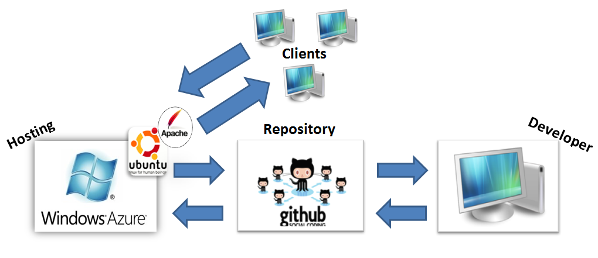
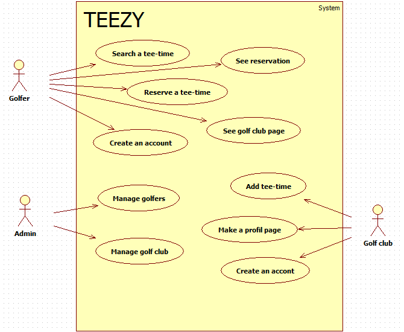

## Introduction

The goal of this project is to develop a website that allows its visitors to 
easily reserve a golf play (a tee-time) in golf clubs in Switzerland, using the 
SCRUM methodology.

## Specifications

Mandatory functionalities:

* responsive web design
* multi-language
* user registration and login
* ability to search tee-time using filters
* warranty payment of the tee-times
* profile page for golf clubs

## Technologies used

As far as responsive web design is concerned, this project relies on Twitter 
Bootstrap 3.0. This framework has allowed us to quickly build a nice-looking 
and responsive prototype, compatible with devices of all sizes.

Since one of the requirements of the project was that a native application 
should be able to connect to the database later on, we decided that a Web 
Service was necessary in the architecture. We have therefore decided to look 
for a server-side framework that would allow us to build it quickly.

The programming language we chose is PHP 5 because all the members of the team 
were already experienced with it. This was not the case with other languages we 
could have chosen such as ASP and Ruby on Rails.

We then decided which framework to use. Two members of the team were 
experienced with CakePHP and another with Yii. None of us was really too keen 
on those solutions, so we chose to look for something new. This is where we met 
Laravel 4, whose simple and clear documentation really impressed us. We decided 
to try it.

We decided to store our project on GitHub because we were already experienced 
with it and it provides easy to use applications for all operating systems.

We then tried to deploy our Laravel repository on Microsoft's Azure cloud 
platform because the Product Owner had access to an account designed for 
start-ups with a few free features. The deployment from GitHub was done in a 
few clicks and went really well. However we soon realized that Laravel wasn't 
fully compatible with the platform we were using. Laravel was meant for Apache 
servers and everything wasn't working out of the box with Microsoft tools. We 
were able to solve those problems, however it took us time and by reading 
Laravel's documentation we realized that more were to come.

This is where we suggested to the Product Owner to switch to Fortrabbit, as 
suggested by Jason Agnew from Big Bite Creative, author of a blog post on how 
to make Laravel work on Azure. The PO then asked us if we could use Linux on 
Azure and this is when we realized that we could create a virtual machine 
running Linux. This is what we have done. We chose Ubuntu Server and installed 
Apache and MySQL on it.

\newpage

## Migrations

`php artisan migrate` runs what Laravel calls migrations. Each migration 
contains a modification made to the database. Running them all is necessary to 
create the database and to use the website.

## Connect to the server

To connect the server type `ssh azureuser@teezy-vm.cloudapp.net` on a Linux 
machine. Use PuTTY on Windows. The password is tfW7LiHK5chSfr

When connecting to the server, the number of security updates available is 
shown. Type `sudo apt-get update` to run the update.

## Tests

### Unit tests

The tests are located in `app/tests`. To run the suite, type 
`/vendor/bin/phpunit` at the root of the code source on a Linux machine. SQLite 
is currently not installed on the virtual machine therefore the tests must be 
runned locally.

### Functional tests

For testing the file upload we used Selenium. First we installed the Selenium 
IDE and then wrote the tests. We wrote test for four different scenarios on the 
admin page.

1. The admin logs in and uploads a image that is smaller than 2 megabytes.
2. The admin logs in and uploads a image that is bigger than 2 megabytes.
3. The admin logs in and uploads an empty image or a bad file.
4. The admin logs in and deletes a file. 

At the end of each test we verified that the correct message is displayed at 
the appearing info box. All tests passed successfully. 

## MySQL login

The database credentials are located in the file `app/config/database.php` 
under the `mysql` section starting at line 55.

## Views

The main layout of the site is located in `app/views/layouts/main.blade.php`. 
All other pages shown to clients extend this layout.

The main layout for the administration part is located in 
`app/views/layouts/admin.blade.php`. The other views this site uses are in 
`app/views/admin`.

## Multi Auth

Since Laravel only allows to have one type of users, which we used in our case 
for the golfers, we had to find how we could be able to allow golf clubs to 
have access (register, login, logout) to the site but with another database 
table. We found a plug-in from Ollie Read that does just that. We simply had to 
rename some methods (`Auth::attempt()` becomes `Auth::golfclub()->attempt()` 
for instance) and change `app/config/auth.php`. Further modifications need to 
be done to Laravel to allow password reminders. For more information see Ollie 
Read's page on GitHub.

## Sprint 1

For this Sprint we have validate the US1, 2 and 3 and the US 4 added at the
middle of the sprint will finish on Sprint 2. Some tasks was a little too
high evaluated we will try to better evaluate tasks for next sprints. We must 
also corrected some little things on the golfclub registration page.

On sprint retrospective we decide to take more story point for the sprint 
2(21). And we have a new ressouve for the developement team (Kevin Kreuzer). We 
have revaluated the US5 to 13 story point. We took US4, 5 and 6 for the Sprint 
2.

## Tee-times "API"

The easiest way we've found for editing tee-times was to make a Javascript page 
communicate with Laravel. To do this we created a sort of API which looks like 
this:

	var myJSONObject = {
		    "date": "2012-03-03",
		    "updates": [
			{
			    "hour": "07",
			    "minutes": "10",
			    "course": "1",
			    "action": "liberate",
			    "price": "120"
			}
			{
			    "id": "7",
			    "action": "delete"
			}
		    ]
		};

Basically every update done to the tee-time calendar is a JSON item inside the 
updates array. Every liberation contains an hour, minutes and a course and each 
suppression contains an id. Then the `action` field tells the controller what 
to do with that tee-time and saves it in the database. The JSON object also 
contains a date which concerns all the updates done for this time.

## SSL

During the creation of the SSL certificate, a "challenge 
password" was asked. It is: PFpZXpWBMy12CU

## Sources

- https://github.com/ollieread/multiauth
- http://code.tutsplus.com/tutorials/authentication-with-laravel-4--net-35593
- http://culttt.com/2013/05/20/getting-started-with-testing-laravel-4-models/
- http://bigbitecreative.com/deploying-laravel-4-azure/
- http://getbootstrap.com
- http://laravel.com
- http://www.windowsazure.com/
- 
http://jasonfunk.net/2013/08/21/troubleshooting-unit-testing-laravel-file-upload-with-mockery/
